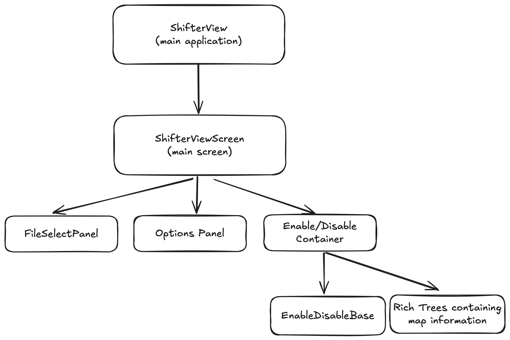
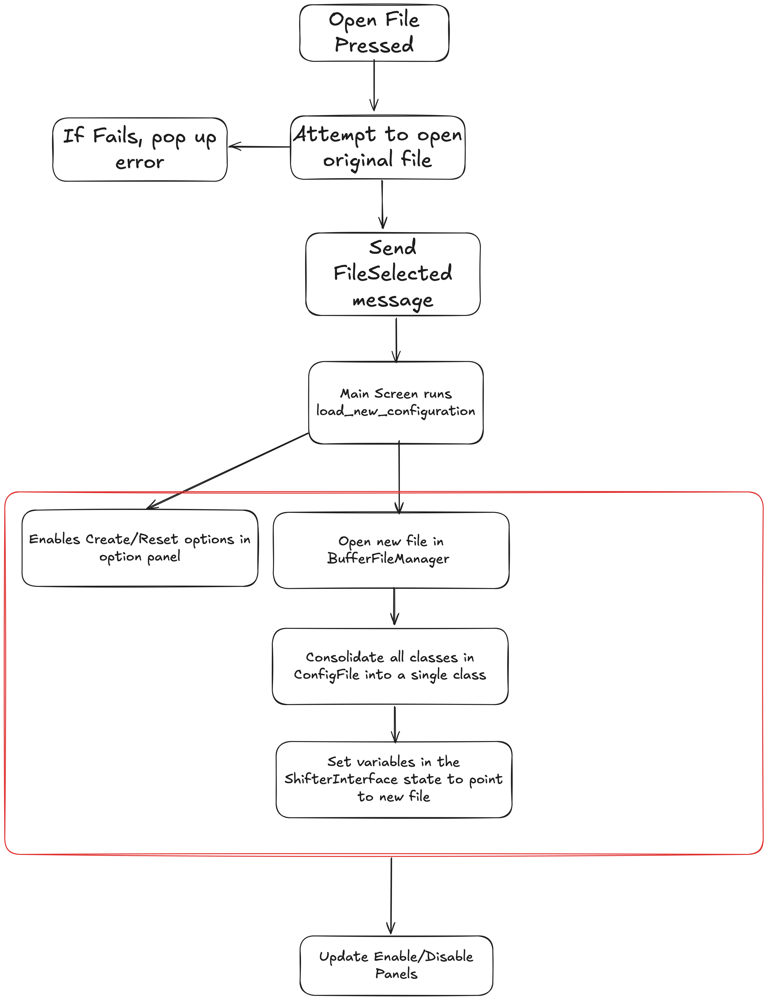

# Instructions for Developers
## Overview
This is a rough guide for de-mistifying the runconf_ui interface! Note, if you just want to setup a new detector instructions are saved [here](shttps://github.com/DUNE-DAQ/runconf-ui/blob/develop/docs/shifter_interface_yaml.md). 

For specific questions about textual, please check [here](https://textual.textualize.io). 

## runconf_ui structure
1. apps: Application storage
2. configuration_manager_interfaces: Interfaces to find config files. This can either be for local or remotely stored configs
3. daq_config_interfaces: Specific interfaces with the configuration via conffwk. Includes a wrapper around the configuration as well as "actions" which define a common interface with the configuration.
4. runconf_ui_configuration: Two groups of objects. Firstly the shifter_config_reader which opens the runconf_ui YAML files. Secondly objects to extract detector information from the yamls
6. runconf_ui_controllers: Single class that contains state information about the entire interface
7. screens: Textual screens
8. utils: Generic utilities for handling files/environment
9. widgets: Textual widgets 

## Interface Logic
### Generating the initial TUI
The intial TUI logic is relatively simple. The CLI call is passed to a Textual application which then presents the user with the "main screen". This main screen is used as a central point to which all inter-widget messages are based. The logic can be seen in the diagram below:

### File Opening
When a file is opened (or indeed when reset is pressed) the interface does the following
1. Checks the file exists and CAN be opened by conffwk [done using calls from the FileSelect widget]
2. Takes ALL objects in configuration databases containing objects used in the selected session and consolidates them into a file in /tmp/
3. Generates updates interface visuals

This is seen in the more detailed view below

### Enabling/Disabling Objects
#### Defining Objects
As discussed in the [configuration docs](runconf_ui_config.md), the interface "knows" what to show the shifter via pre-defined objects stored in a YAML, for example [np02_configuration.yml](../src/runconf_ui/config_files/detector_configs/np02_configuration.yml). Here we define several subsystems divided into two groups:
- `singlesystem`: These are simple subsystems where ALL objects inherit from component and are independent of each other
- `multisystem`: Here we define collections of objects and sub-systems. For example the TPC button also contains two subsystems (CRP4/5).

The single-system enable/disable logic is controlled by [single_component_panel.py](../src/runconf_ui/widgets/single_component_panel.py) which simply enables and disables the objects via the standard conffwk disable logic. The logic behind mulit-system panels is more complex and detailed below.

#### Multi-System Logic
The bulk of this interface goes into defining what we mean when we say something is enabled or disabled. For many objects such as the TPG this requires mixtures of objects that inherit from component (and can thus be disabled through OKS) and those that don't. In order to handle this logic, we use a series of objects in [detector_config_readers](../src/runconf_ui/runconf_ui_configuration/detector_config_readers/). The lowest level of which are 
- [Component Extractor](../src/runconf_ui/runconf_ui_configuration/detector_config_readers/component_extractor.py) which handles objects which CAN be enabled/disabled via conffwk.
- [Attribute Extractor](../src/runconf_ui/runconf_ui_configuration/detector_config_readers/attribute_extractor.py): Which handles attributes inside these objects

A full system is comprised a subset of both of these objects and is stored in [system_extractor.py](../src/runconf_ui/runconf_ui_configuration/detector_config_readers/system_extractor.py). This also contains logic for handling subsystems via the "label" variable. For example CRP4 and CRP5 are both controlled by the TPC system BUT are also stored within this system as part of CRP4 or 5.

Finally each superset of system_extractors (for example detector or TPG) is stored in [detector_extractor.py](../src/runconf_ui/runconf_ui_configuration/detector_config_readers/detector_extractor.py). This allows for a single interface to set/get the status of all systems and is the main interface through which the rest of runconf-ui communicates with this somewhat complicated chain of logic.