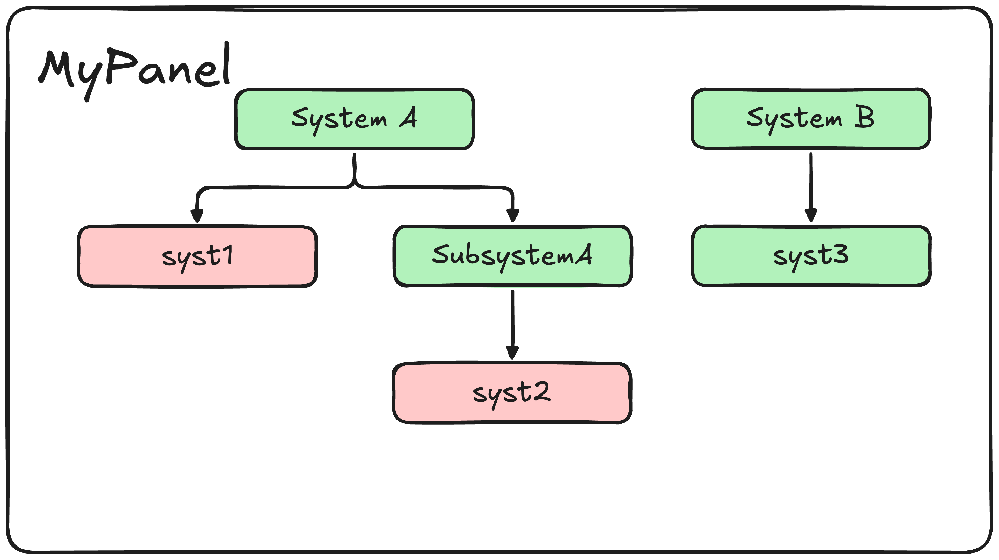

Developer Guide
===============

We also provide an :doc:`API reference <../api_reference/api_reference>` that documents the internal structure and components of runconf-ui.  
This guide is intended to help developers understand the architecture and how to contribute to the project.

.. image:: ../../_static/overview.png
   :alt: Developer Guide

Code Structure
--------------

The codebase is functionally split in half:

* The backend, which is responsible for the core logic (opening configurations + repo management)
* The textual frontend. This accesses the backend through a single :class:`RunconfUIBackend` class, which is the main interface for the frontend to interact with the backend.

We will first walk through the backend from the perspective of a user opening a configuration, and then we will discuss the frontend and how it interacts with this.

The Backend
-----------

The backend is managed by a single entrypoint class, :class:`RunconfUIBackend`, which is responsible for managing the state of the application and providing an interface for the frontend.

There are several responsibilities:

* Deciding how to manage a ``runconf-ui`` repo, which can operate in ``local`` and ``remote`` modes
* Reading input system configuration ``yaml`` files to determine what is visible to the user and how it is grouped
* Managing the state of OKS objects as a tree to determine what is enabled/disabled and propagate changes to the UI
* Opening OKS files and consolidating the configuration into a single buffer config

We will go through each of these responsibilities in more detail below.

The Repo Manager
~~~~~~~~~~~~~~~~

There are two repo managers available in ``runconf``:

- :class:`LocalRepoManager` — Manages repositories stored locally on the filesystem
  - Requires the user to specify the path to the repository
  - Requires the apparatus

- :class:`RemoteRepoManager` — Manages repositories stored in a Git repository via `runconftools <https://github.com/dune-daq/runconftools>`_
  - Requires the user to specify the repository URL (ops and base)
  - Requires the apparatus
  - Requires the specific name of the configuration file

Both inherit from the interface :class:`RepoManagerInterface` and implement the necessary methods to manage repositories.  
The repo managers are responsible for locating configuration files and providing paths to the application.

System Configuration
~~~~~~~~~~~~~~~~~~~~

This section details how YAML system configs are read by the application.  
Full details on the structure of the YAML system configuration files can be found :doc:`here <system_configuration>`.

Once a user has selected a repo using a repo manager, the paths for the OKS and system configuration files are passed into :class:`SystemConfigReader`.

This will:

1. Generate a :class:`SystemConfig` object from the YAML file (a nested dataclass representation)
2. Combine it with the OKS config via :class:`ConfigAssembler`
3. Produce an :class:`AssembledConfig`

An :class:`AssembledConfig` consists of lists of trees representing the full configuration structure.

For example, given the YAML:

.. code-block:: yaml

   PanelOptions:
      MyPanel:
         systems:
         - SystemA:
               components:
                  - id: syst1
                    class: Systematic

                  - id: syst2
                    class: Systematic
                    system_label: SubSystemA
         - SystemB:
               components:
                  - id: syst3
                    class: Systematic

This produces an :class:`AssembledConfig` like:

The exact tree structure is discussed below.

The Configuration Tree
~~~~~~~~~~~~~~~~~~~~~~

When a configuration is read into Runconf-UI, the :class:`ConfigAssembler` converts it into a tree.

There are two types of :class:`Node` used:

* :class:`Leaf` — Represents leaves in the tree. These contain individual objects and use OKS to determine enabled/disabled state.
* :class:`Group` — Represents groups of nodes.

The state of the tree at any given time is calculated using :func:`compute_state`, which traverses the tree and produces :class:`NodeStatus` objects.

The :class:`Leaf` nodes are produced in factories dependent on the type of object (component, attribute, relationship, adjustable) stored on the leaf.

The Full Backend Class
~~~~~~~~~~~~~~~~~~~~~~~
The :class:`RunconfUIBackend` is the central controller of runconf-ui. It requires some context to boot up the repo manager and then
provides a pseudo-API. 

It provides an interface between and to the other classes discussed above and provides the textual layer with all relevant information

.. note::
   Currently the backend class is rather oversized and cumbresome. A refactor is planned in future

Textual
--------
The textual interface contains a main application, :class:`RunconfUIApp` which interfaces with the backend as well as several widgets.
The interface is designed to be relatively lightweight with all widgets simply using textual's `Message` system to provide/obtain
state information from the main application.