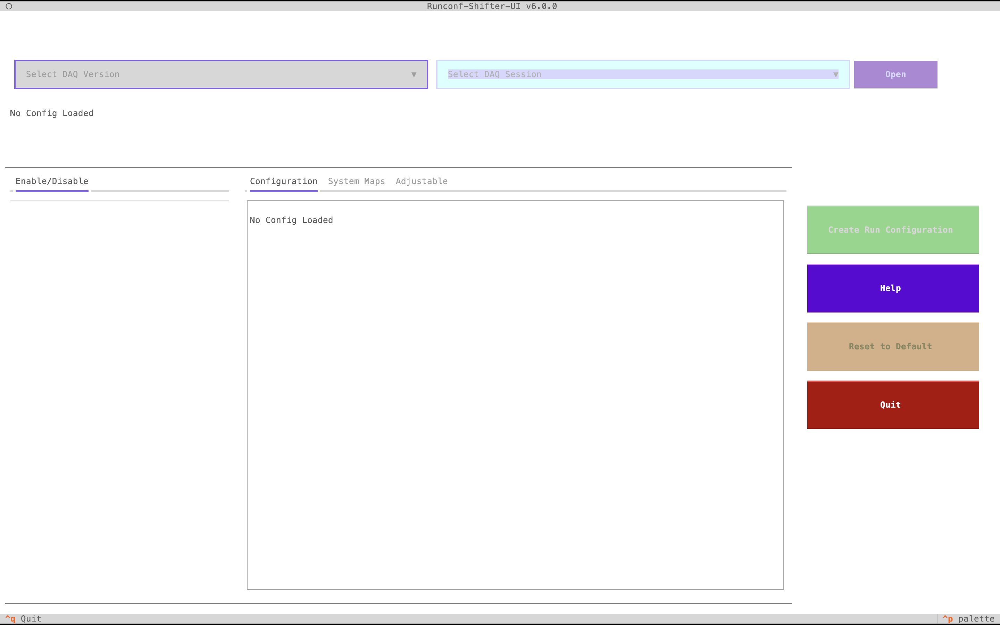
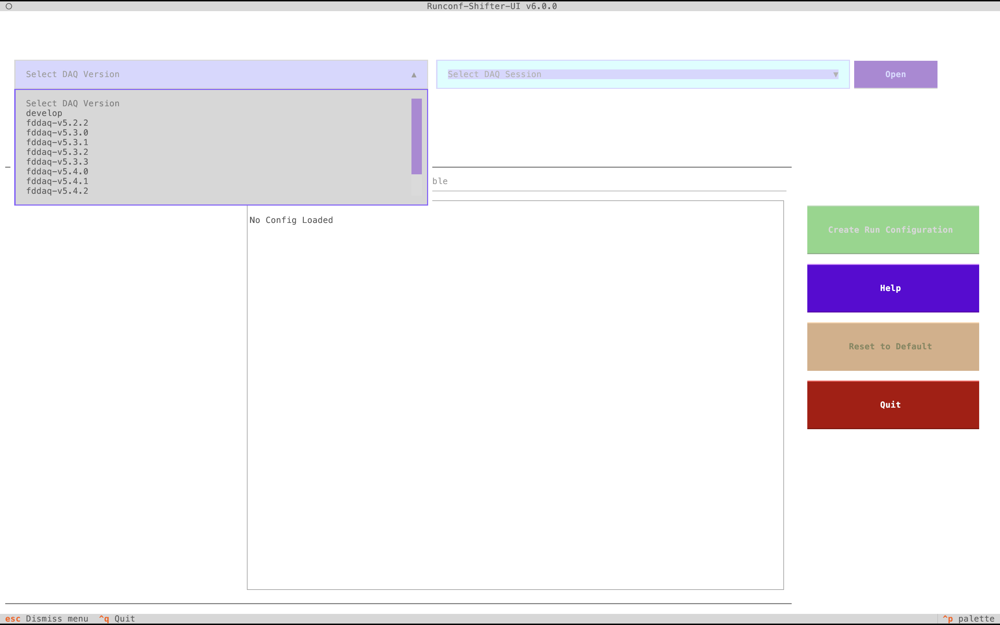
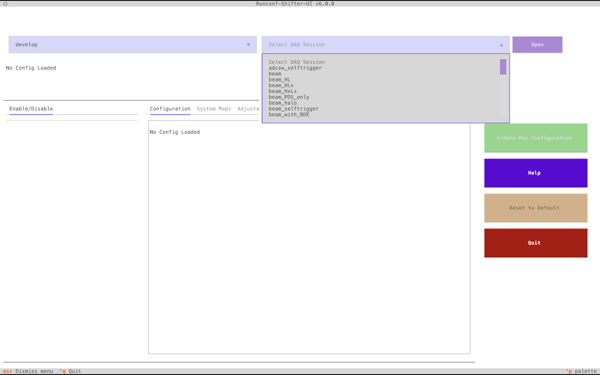
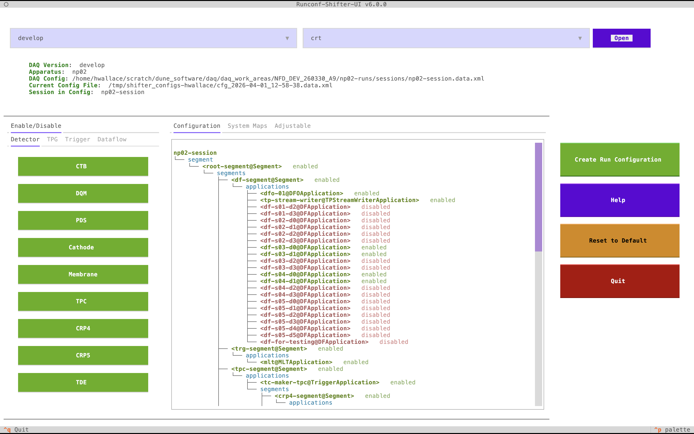
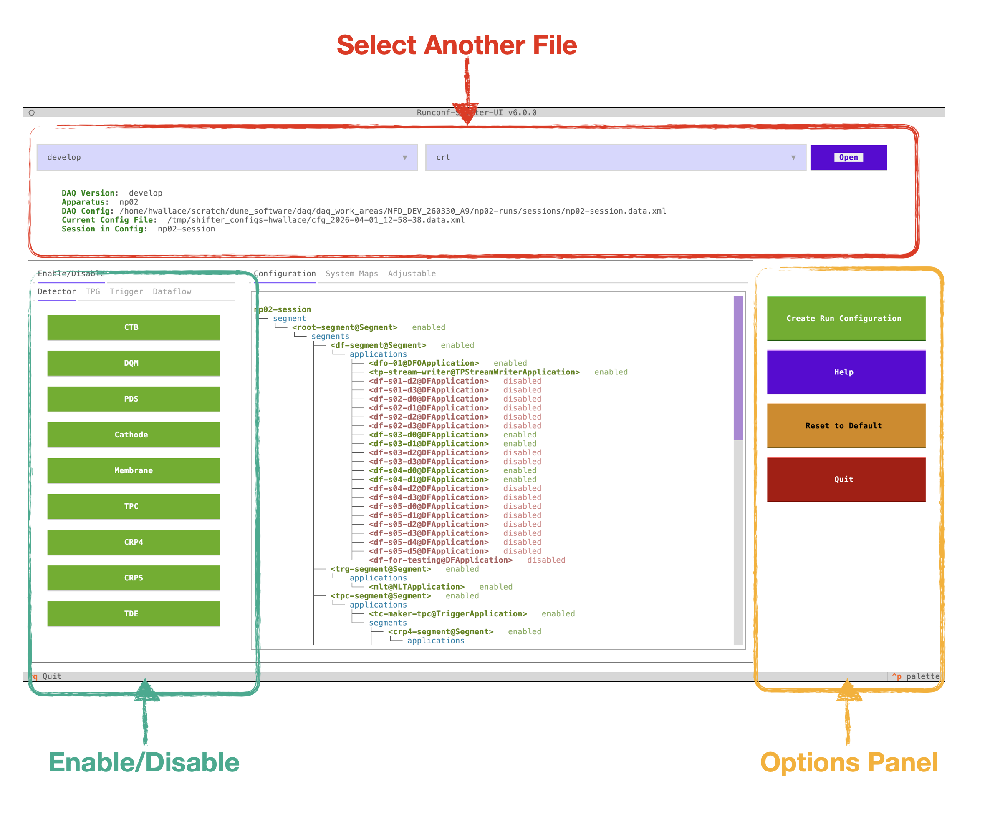
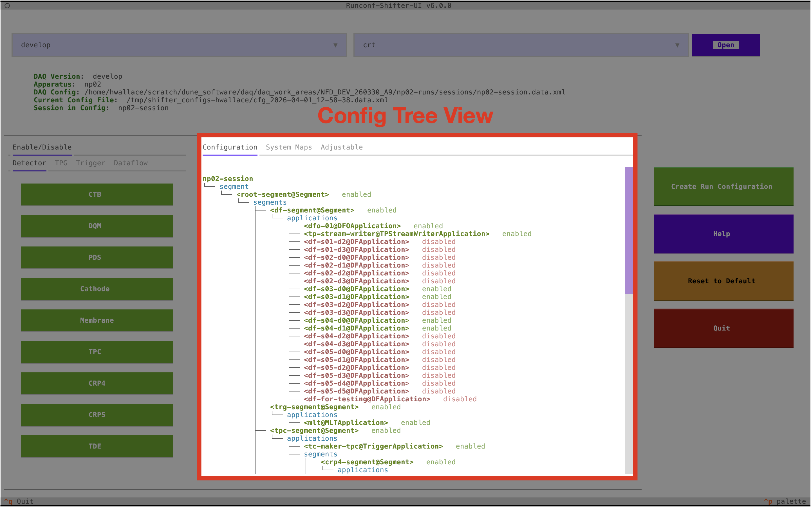
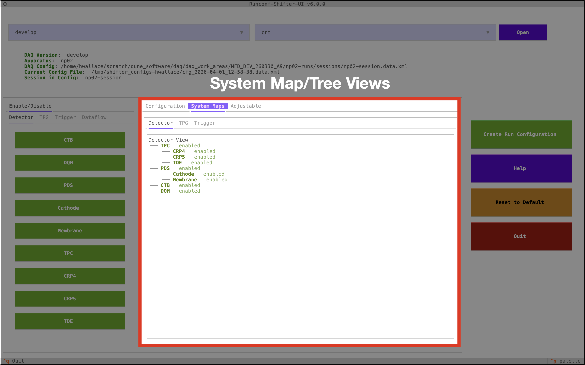
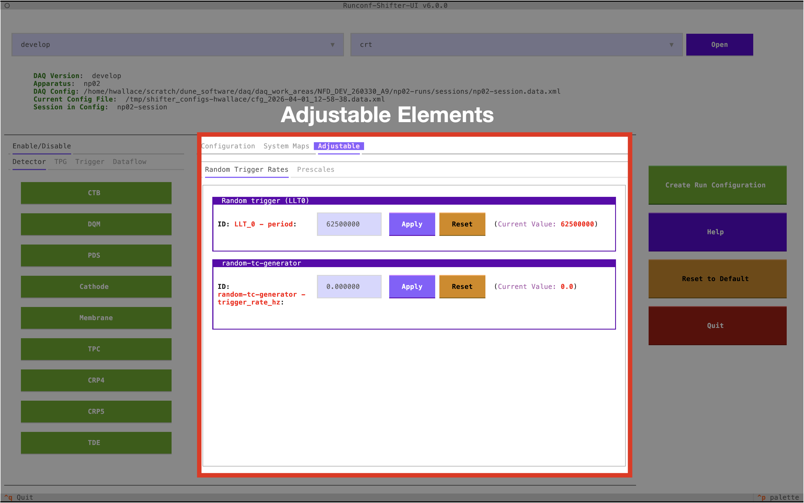

# Quick Start

To get started, follow the [Installation Guide](README.md) in the README to set up the environment and install the necessary dependencies. Once runconf-ui is installed you can launch the application and start exploring its features.

## Command Line Interface

Runconf-UI is launched through the command line with:

```bash
runconf-shifter-ui [OPTIONS]
```

Environment setup scripts are provided to replicate the environment required for various detectors:

```bash
source runconf_<YOUR DETECTOR NAME>_env_setup.sh
```

Currently provided detectors are `np02` and `np04`.

The app can be booted in local mode (`-l`) or remote mode. Remote mode requires the ops and base repositories to be provided as well as the name of the configuration file (containing a `Session`) you wish to use.

### Options

| Option | Short | Env var | Default | Description |
|---|---|---|---|---|
| `--apparatus` | `-a` | `APPARATUS` | *(required)* | DAQ apparatus name, e.g. `NP02` or `NP04`. Used by `runconf-ui` to find the detectory YAML as well as by the remote repository manager to find the correct base configuration repo.|
| `--config-directory` | `-c` | `CONFIG_DIR` | | Path to your local config directory. i.e. "where will the repository manager look for configs" |
| `--use-local` | `-l` | | `False` | Use the local filesystem for the OKS config instead of a remote repository.  |
| `--config-file-name` | `-f` | `SESSION_FILE` | | Config file to find in the ops repository, e.g. `run.data.xml`. Remote mode only. |
| `--base-url` | `-b` | `BASE_URL` | `ssh://git@gitlab.cern.ch:7999/dune-daq/online/ehn1-daqconfigs.git` | URL for the base DAQ config repository. The `BASE` branch of the git repo from which all others will be merged in. Remote mode only. |
| `--ops-url` | `-r` | `OPERATION_URL` | | URL for the operations repository. Remote mode only. The specific operational repository, for example the configuration specifically relating to the CRT |
| `--output-directory` | `-o` | | `shifter-configs` | Directory to save generated run configs to. |
| `--log-level` | `-d` | | `INFO` | Logging verbosity: `INFO`, `WARNING`, or `DEBUG`. |

All options that have a corresponding environment variable can be set either way; the CLI flag takes precedence.

---

## Using the App

### Opening a Config

Once loaded, the application will look like this:



The first step is to select your DAQ version using the drop-down menu:



Once selected, the Session selector becomes enabled, allowing you to select a session:



After selecting a session a small loading bar will appear while the display is set up and the backend generates the configuration tree. You should now have a view that looks like:



### Modifying a Config

The steps to modifying a config are straightforward:

1. In the enable/disable panels, turn on or off what you want enabled or disabled.
2. In the adjustable element panels, adjust the values of things you want to adjust.

Once done, press **Create Run Configuration** and then **Save and Quit**. This will print out the DRUNC command to run the config.

---

## Interface Overview



The above image shows the primary methods for interfacing with the application:

- The **file select** can be used to open another config.
- The **enable/disable buttons** can be pressed to enable or disable items in the configuration. The tabs group together different parts of the detector.
- The **options panel** contains Create/Quit (both give the option to save and quit), Reset (resets the configuration to its initial state), and Help (brings up a small help box).

### Configuration Tab

The large central panel contains a few useful features. The configuration map/tree view, shown below, displays the full configuration and all enabled/disabled elements. It is accessible by pressing the **Configuration** tab.



### System Maps Tab

The **System Maps** tab displays the enable/disable states for each panel as well as how each button relates to others. For example, you can see that a `TPC` button is controlled by `CRP4`, `CRP5`, and `TDE`.



### Adjustable Tab

Adjustable elements (trigger rates, etc.) are accessed via the **Adjustable** tab. Each row shows the object name and attribute on the left and its current value on the right. Use the **Apply** button to commit a new value and **Reset** to revert to the original value loaded from the configuration file.



> **Note:** If the object containing an adjustable element is disabled, you will not be able to modify it in this menu.