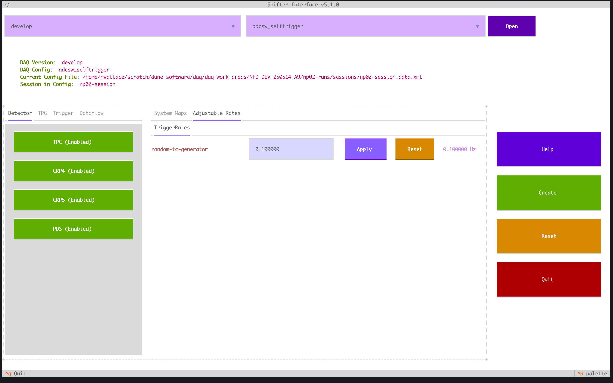

# Configuring the Shifter Interface

## Setting up environment

The runconf_ui YAML files [stored in src/runconf_ui/configuration] are used for two purposes:

1. Configure the environment used by shifter-view
1. Tell shifter-view which parts of the configuration correspond to which bit of the detector

## Environment setup

For now shifter view looks for a configuration YAML called `/path/to/runconf_ui/src/configuration/${APPARATUS}_configuration.yml`, for example, `np02_configuration.yml`. This can also be set using the `--shifter-interface-config` flag at start up.

**NOTE** If you're not in a shifter TMUX session you need to call `source runconf_X_env_setup.sh` \[currently, we have `runconf_np02_env_setup.sh` and `runconf_np04_env_setup.sh`\]. This script can be called from anywhere and will initialise the TMUX environment variables required by `runconf-ui`.

The environment settings are stored in `General`. These are settable either as direct paths/variables OR if the interface finds a corresponding environment variable, that variable. In the below config you can see examples of both of these settings. One can also over-ride any of these settings using the CLI at startup.

```yml
General:
  # Environment variables

  # Default .data.xml configuration file
  session_config: "SESSION_FILE"
  # Default download directory for DAQ configuration files OR local directory containing configurations
  download_directory: "CONFIG_DIR"
  # Name of TMUX session
  session_name: "SESSION_NAME"

  ## CONFIGURATION MANAGER  SETTINGS

  # Grabs git branch "default_daq_version/default_daq_config"

  # Default DAQ version 
  default_daq_version: "EHN1_DEFAULT_VERSION"
  # Default DAQ configuration file 
  default_daq_config: "EHN1_DEFAULT_CONFIG"

  # URL containing git repos
  base_url: "https://gitlab.cern.ch/dune-daq/online/ehn1-daqconfigs"
  # URL containing git repos for the operation configuration
  operation_url: "https://gitlab.cern.ch/dune-daq/online/np02-configs-operation.git"

```

### Changing Base URL

YOU CANNOT CHANGE THE `base_url` OF A REPO THAT EXISTS. TO DO THIS PLEASE SET `download_directory` TO POINT TO A NEW DIRECTORY!

This can either be done from the command line like

```bash
runconf-shifter-ui -d path/to/new/repo --base_url new/base/url
```

or by setting the variables in the YAML (either by changing the environment variables themselves or the YAML config).

## Detector Setup

The DUNE-DAQ configuration framework does not currently have a natural way of grouping detector components. In order to tell the interface which elements we want to display we need to set these manually. In the language of `runconf_ui` these grouped into Panels, so called because they generate "panels" in the TUI.

### Full Panel description

Full panel description with defaults if provided

```yml
---
Settings:
  # List of classses to show on map panels
  classes_to_show [list str]:
    

# PanelOptions are the list of "panels" that display both trees (if view_panel has a name) and lists of what to show
PanelOptions:
  # Panel ID
  Panel: 

    # Label given to panel
    label [str]:  
     # Display name for attribute map
    view_panel [str]: 

    systems: # List of systems
      - SystemA: # A specific system

          # If we turn off all the subsystems do it also turn of the entire system
          subsytem_dependent [bool]: false 
          # Include a button for enabling/disabling the entire system
          display_full_system [bool]: true 
          
          # List Components are elements that can be enabled/disabled at the session level
          components: 

              # Component ID. If each_component_seperate is true 
              # then id needs to be a substring common to all components you want to show
            - id [str] : 
              # Component class
              class [str]: 

              ~~[[Optional Values]]~~

              # do these components also live in a seperate subsystem?
              separate_system [bool]: false 
              # Subsytem they live in [useful for things like TPC where you want to toggle individual CRPs] 
              system_label: None  
              
              # What if we want lots of components and separate buttons for each one?
              # Generate a button for each component of class [class] with id containing a substring of ID
              each_component_separate [bool]: false 

              # We then filter based on the attributes of these objects
              filters [List[Dict]]: 
               # name of the attribute to filter by
                - attribute [str]: ""
                  # list of values to exclude
                  values List[Any]: []
              
              # We can display a tooltip
               # If the tooltip is an attribute in the object it will display that attribute as the tooltip
              # For example if an object has a "description" attribute it will display the value of "description
              tooltip [str]: ""
          
          # We can also toggle the attributes of groups of objects 
          attributes:
            # Name of the attribute
            - id [str]:
              # Segments to search for objects in
              segment [List[str]]: ["root-segment"]
              # Class of objects with attribute
              class [str]: 

              ~~[[Optional Values]]~~
              # Attributes may not have simple true/false enabled/disabled states
              # This lets us over-ride this behaviour and define custom enabled disabled states
              enabled_state [Any]:
              disabled_state [Any]:
              
              # Subsystem settings (same as component)
              system_label [str]: 
              separate_system [bool]: False

              # Tool tip here will just directly print the string (but only if it's a separate system)
              tooltip [str]: ""

          # The final thing we can toggle is the relationship between objects
          # As these are essentially attributes most of the interface is the same
          relationships:
            # Same as attribute:
            - id [str]:
              class [str]:
              segments List[str]: ['root-segment']

              # Relationship-specific options
              # We need to know the expected class of object the relationship needs
              relationship_class [str]:

              # Name of single/list of config objects that 
              # object has relationship to when toggled on/off
              # To remove the relationship entirely just needs to be left as []
              enabled_state [str | List[str]]: 
              disabled_state [str | List[str]]: 

```

### General Panel Attributes

The first things that need to be setup in panels are the general settings

```yml
Panel: 
    label: "Internal label given to this panel. This must be unique"
    view_panel: "Panel we give view"

```

Enable/disable buttons are generateed using panels. For example, the tpg in NP02 is defined several complicated sub-components. In order to handle this we use multi-system panels. An example of thsi can be seen in the trigger for NP02

```yml
  Trigger:
    label: "trigger"
    view_panel: "Trigger View"

    Systems:
      - TPC TPG:
          attributes:
              - id: tp_generation_enabled
                segments: ["tpc-segment", "crp4-segment", "crp5-segment"]
                class: ReadoutApplication

              - id: ta_generation_enabled
                segments: ["tpc-segment", "crp4-segment", "crp5-segment"]
                class: ReadoutApplication

          components:
            - id: tc-maker-tpc
              class: TriggerApplication
            - id: tp-stream-writer
              class: TPStreamWriterApplication

      - PDS TPG:
          attributes:
              - id: tp_generation_enabled
                segments: ["pds-segment"]
                class: ReadoutApplication
    
              - id: ta_generation_enabled
                segments: ["pds-segment"]
                class: ReadoutApplication

  # Dataflow
  Dataflow:
    label: "dataflow"
    panel_type: "multisystem"
    systems:
      - Dataflow:
        subsystem_dependent: False
        disaplay_full_system: False
        components:
          - id: ""
            class: "DFApplication"
            each_component_separate: True

```

Firstly we have the name of the **panel** in the TUI, in this case `Detector`. Firstly we need to specify `view_panel`, this is the label given to the schematic view generated by this system. All multi-system panels generate schematic views in order to visualise what we mean when we say "this system is switched off". Next we list each system in this panel, these are seen in the TUI as individual on/off buttons, in this case the TPCs for TPG and PDS. Finally we split our systems into attributes and components.

Components correspond to large-scale elements of the DAQ, for example ReadoutApplications and Segments. In OKS these have a specific definition of disabled/enabled. Attributes, meanwhile, are values of elements within the configuration. For example every `ReadoutApplication` has a `tp_generation_enabled` attribute which can be enabled/disabled.

#### Components

Firstly let's look more closely at the settings for components

```yml
# Required settings
- id: Compoent Name
  class: Class of the component in the configuration
# We also have some optional settings
  seperate_system: Does this component also correspond to an additional subsystem 
  system_label: Label of this subsystem
```

One can see this more obviously if we look at the TPC

```yml
- TPC:
  subsystem_dependent: True

    components:
    - id: tpc-segment
        class: Segment
    - id: crp4-segment
        class: Segment
        system_label: CRP4
        separate_system: True

    - id: crp5-segment
        class: Segment
        system_label: CRP5
        separate_system: True
```

This will generate the following buttons:

1. TPC: This will enable/disable all the components in the configuration
1. CRP4: This will just turn off all components [and attributes] labelled `CRP4`
1. CRP5: This will just turn off all components [and attributes] labelled `CRP5`

Since we've set the `subsystem_dependent` flag to true, the entire system (`tpc-segment`) is set to be disabled if the two sub-systems in it (`CRP5`, `CRP4`) are disabled.

Let's now consider a subsystem where you want to display ALL objects in the configuration satisfying some conditions.

```yml
Trigger:
  label: "trigger"
  systems:
    - Trigger: 
      display_full_system: False
      components:
        - id: ""
          class: CTBHLT
          each_component_separate: True
          filters:
            - attribute: "description"
              values: ["Spare", "spare"]
```

Here we have the following logic; When `each_component_separate` is set to true it will attempt to find EVERY element in the configuration which

1. Is of class `class` (note: this include subclasses of `class`)
1. Has an `id` (name) that contains a substring of `id`. Here we want to get all `CTBHLT`s so we set `id` to be an empty string
1. Does not have a `description` of `Spare` or `spare`.

#### Attributes

Settings for attributes slightly more complex than components. Let's consider the attributes of the `TPC TPG`

```yml
      - TPC TPG:
          attributes:
              - id: tp_generation_enabled
                segments: ["tpc-segment", "crp4-segment", "crp5-segment"]
                class: ReadoutApplication

              - id: ta_generation_enabled
                segments: ["tpc-segment", "crp4-segment", "crp5-segment"]
                class: ReadoutApplication
```

You can see that these correspond to the following

1. `id`: The name of the attribute
1. `class`: The class of objects with this attributes we want to find
1. `segments`: In which segments should we search for objects with this attribute. If this is not specified it assumes it corresponds to ALL objects of this class in the configuration.

As with components one can also specify `system_label` and `separate_system` to make additional buttons in the configuration.

## Adjustable Triggers

In addition to being able to turn on and off things the shifter-ui lets the user adjust the values of various trigger rates. This can be added using an `AdjustableAttributes` entry to the detector config file i.e.

```yaml
Settings:
  ...
PanelOptions:
  ...
AdjustableAttributes:
  AttributeGroup: # Group of attributes to put in a tab
    - label [str]: # internal label to keep textual sane
    Systems:
      - object_id [str, Optional]: # ID of object containing a given attribute. If left blank it will search for all objects of a given class
        object_class [str]: # Class of objects with given attribute
        attribute_name [str]: #Name of attribute to modify 
        is_hex [bool, optional]: False # Is the attribute stored in hex
        tooltip [str, optional]: # Attribute to use as the tool tip i.e. "description" when higlighting box

        # values to filter by
        filters [List]:
          - attribute [str]: # attribute to filter by
            values [List[Any]]: # List of values of that attribute you want to exclude


```

The result is a view like


As you can see this is an additional tab in the same place as the map view. The left hand text gives the object name + attribute whilst the text on the far right tells you its current value. The apply button changes the value of the attribute and reset sets it to its original value in the configuration file.
